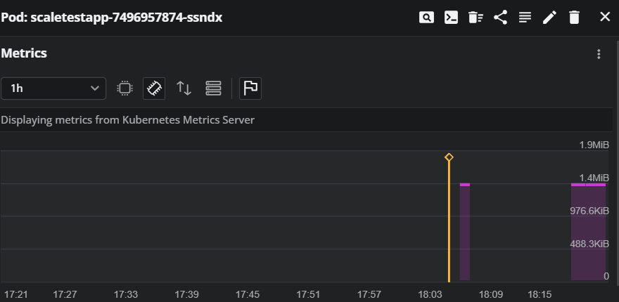
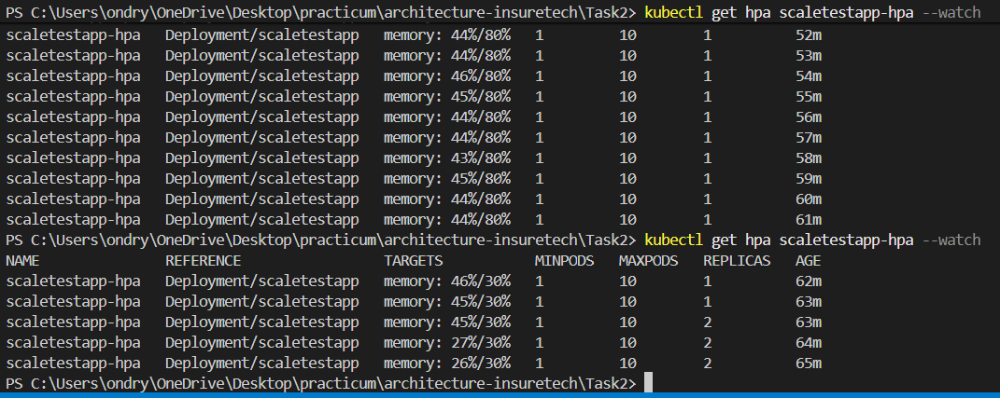
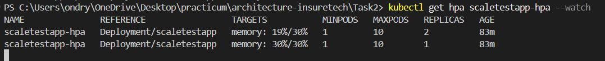

## Активация в кластере metrics-server:

```bash
# Проверить наличие metrics-server
kubectl get deployment metrics-server -n kube-system

# Если metrics-server не установлен, установить его: 
minikube addons enable metrics-server

# Проверить 
kubectl get pods -n kube-system -l k8s-app=metrics-server -w
```

## Применение манифестов

```bash
# Применить все манифесты
kubectl apply -f .
```

## Параметры HPA

Целевая утилизация памяти : 80%

* Минимальное количество реплик : 1
* Максимальное количество реплик : 10
* Политика масштабирования вверх : до 100% увеличения каждые 15 сек или максимум 2 пода за 60 сек
* Политика масштабирования вниз : максимум 10% уменьшения каждые 60 сек с периодом стабилизации 5 минут

## Мониторинг HPA

```shell
# Проверить статус HPA
kubectl get hpa scaletestapp-hpa

# Подробная информация об HPA
kubectl describe hpa scaletestapp-hpa

# Мониторинг в реальном времени
kubectl get hpa scaletestapp-hpa --watch

# Проверить метрики подов
kubectl top pods -l app=scaletestapp
```

## Тестирование автомасштабирования

Для проверки работы HPA можно создать нагрузку на приложение:

```bash
# Перенаправить порт для доступа к приложению
kubectl port-forward service/scaletestapp-service 8080:8080

# В другом терминале создать нагрузку
# Пример скрипта для создания нагрузки на память:
while true; do
  curl -s http://localhost:8080/health > /dev/null
  curl -s http://localhost:8080/id > /dev/null
done
```



Теперь приступим к нагрузочному тестированию (если работаете под Windows, то через wsl)

### Установка Locust

```bash
pip install locust
```

### Запуск мониторинга

в отдельном терминале запустите

```bash
kubectl get hpa scaletestapp-hpa --watch
```

### Запуск Locust

Из директории Task 2

```bash
# Запустить Locust
locust

# Или если не работает, через Python модуль:
python -m locust
```

В консоли нажмите Enter - откроется браузер - надо ввести параметры тестирования

### Параметры веб-интерфейса Locust:

1. Откройте браузер и перейдите на [http://localhost:8089](http://localhost:8089/)
2. Настройте параметры:
   * **Number of users** : 10-50 (начните с малого)
   * **Spawn rate** : 5-10 users per second
   * **Host** : [http://localhost:8080](http://localhost:8080/) (должно быть уже заполнено)
3. Нажмите "Start swarming"

Локально я не смог нашрузить сервис более 46%, поэтому уменьшил порог утилизации до 30% и тогда автоскейлинг сработал



## DownScaling

Тут указал порог 20%



## Ожидаемое поведение

1. При утилизации памяти выше 80% (при тестировании выставил 30%) HPA будет увеличивать количество подов
2. При снижении нагрузки HPA будет постепенно уменьшать количество подов
3. Количество подов всегда будет в диапазоне от 1 до 10
