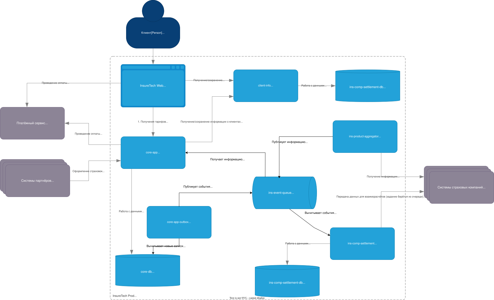

# Анализ архитектуры

## Текущая архитектура

1. Синхронные запросы к внешним API
   - Интеграция с внешними API может быть нестабильна.
   - Внутреннее взаимодействие выполнено в стиле `direct call`. Если вызов к внешней системе падает, то нужно проектировать цепочку компенсационных действий. `ins-comp-aggregator` и `ins-comp-settlement` становятся точкой отказа внутри системы.
   - Это влияет на `core-app` и `InsureTech Web`: задержки и ошибки при REST-запросах
   - При добавлении новых интеграций `ins-comp-aggregator` начнёт становиться точкой отказа и медленнее высвобождать ресурсы. Что может привести к его падению.
2. Частота опроса
   - `core-app` опрашивает `ins-comp-settlement` и `ins-comp-aggregator` по расписанию. При один сервис зависит от другого. Если У одного из них будут не актуальные данные, то у другого так же может быть задержка. Что может привести к просрочке во взаиморассчётах и денежным потерям.
3. Дублирование данных.
   - Локальные реплики создают риск неконсистентности данных внутри системы и принятии ошибочных бизнес-решениях.
   - При большом числе сервисов и компаний — поддержка консистентности станет сложной.
   - Растут накладные расходы на "железо".
4. REST-зависимость между сервисами
   - как писал выше - много `direct call` - это приводит к ситуации распределённого монолита.
   - `ins-comp-settlement` зависит от `core-app` для получения страховок
   - REST-зависимости вызывают «узкие места» — если один сервис недоступен, то происходит отказ обслуживания во многих местах системы.

## Aрхитектура TO BE

1. `ins-comp-aggregator` берёт задания и опрашивает страховые компании и публикует результаты в брокер сообщений
   - `core-app` и `ins-comp-settlement` подписываются на события брокера
   - Устранены прямые синхронные вызовы, система умеет работать с нестабильным внешним API
2. В `core-app` применить Transactional Outbox при оформлении страховки
   - Outbox гарантирует, что данные будут доставлены
   - Внедрить тдемпонтентность операций, если она отсутсвует, так как OutBox паттерн даёт гарантию доставки At Least Once

