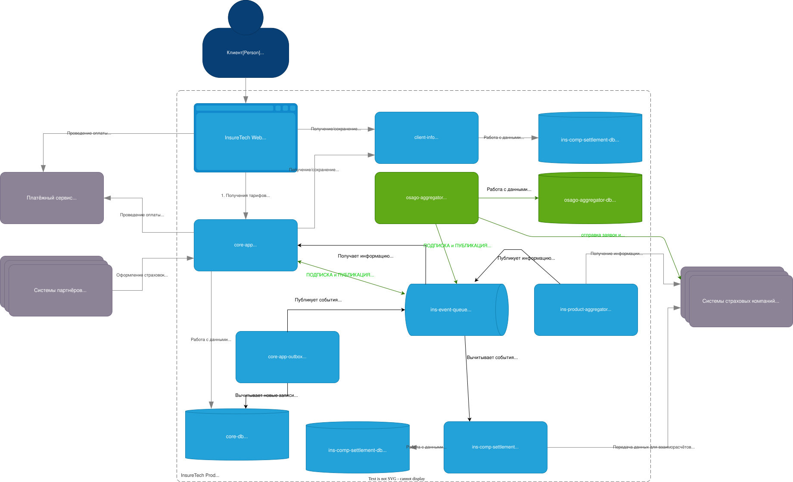

# Проектирование продажи ОСАГО

- *Требуется ли ему своё хранилище данных?*
- Да, требуется. В рамках него будем контролировать идемпотентность работы с заявками, так как очередь не гарантирует доставки ровно 1 раз, а внешние API могут быть платными. Дополнительно, мы сможем сохранить решение по заявке, даже если клиент покинул сайт, не прождав более 60 секунд. Кроме того, можно будет на основании истории заявок, делать предварительные заявки и предлагать продажи клиентам.
- *Какой API он предоставляет core-app?*
- Подписка на события по заявке на осаго или по коду клиента (событие "разместить заявку", событие "решение по заявке", событие "оформить ОСАГО по заявке").
- *Определите средство интеграции между сервисами core-app и osago-aggregator.*
- Apache Kafka, при заявленном прогнозируемом уровне подписчиков (до 2,5 тысю клиентов) должен выдержать нагрузку.
- *Подумайте над API для веб-приложения в core-app.*
- Опустим методы авторизации и аутентификации. Будем считать что нужно 2 метода

  ```text
  # разместить заявку и ждать 60 секунд ответа
  POST /api/v1/web/calculate/osago

  # получить список моих заявок на osago
  GET /api/v1/web/calculate/osago

  # получить решение по сврей заявке
  GET /api/v1/web/calculate/osago/{requestId}

  # это расширяемый контракт, 
  # добавить данные в заявку мы сможем в теле запроса, 
  # в GET запрос списка мы сможем добавить параметры для фильтрации
  ```
- *Определите средство интеграции между веб-приложением и core-app. Если будете использовать средство, отличное от REST, отразите интеграцию новой стрелкой.*
- Оставим использование REST и long polling запросы на получение ответа на размещённую заявку. Так как приложения могут быть запущены в нескольких экземплярах, это позволит сохранить state и получить уведомление в нужном экземпляре сервиса. 2500 клиентов в пике, это позволит выдержать, с учётом online клиентов. Если будем проектировать API для подрядчиков - рассмотрим другой вариант.
- *В зависимости от выбранных средств интеграции подумайте, требуется ли где-то применение паттернов отказоустойчивости: Rate Limiting, Circuit Breaker, Retry, Timeout.*
- Да, потребуется, на обращение к core-app из web приложения настроим timeout, 60 sec + time lag на внутренние операции, time lag вынесем в настройки. Так же потребуется Rate Limit, то же по настройкам, опирается на идентификатор клиента. Circuit Breaker настроим по кол-ву активных запросов на ОСАГО, можно взять 2500 одновременных сессий. Retry настроим при отправке запросов в страховую в расках серии запросов по заявке. Потом добавим Retry через заданные интервалы (сценарий получения решения и высылки клиенту в личный кабинет).

## Учет множественных экземпляров сервисов

- Так как RateLimit и Timeout должны быть одинаковыми, если мы не знаем на какой инстанс приходит обработка заявки, то нужно добавить кластер Redis, для хранения в нём состояния.
- Добавить load balancer при обращении от web ui к core app, чтобы исключать из обработки запросов инстансы, которые перегружены.


