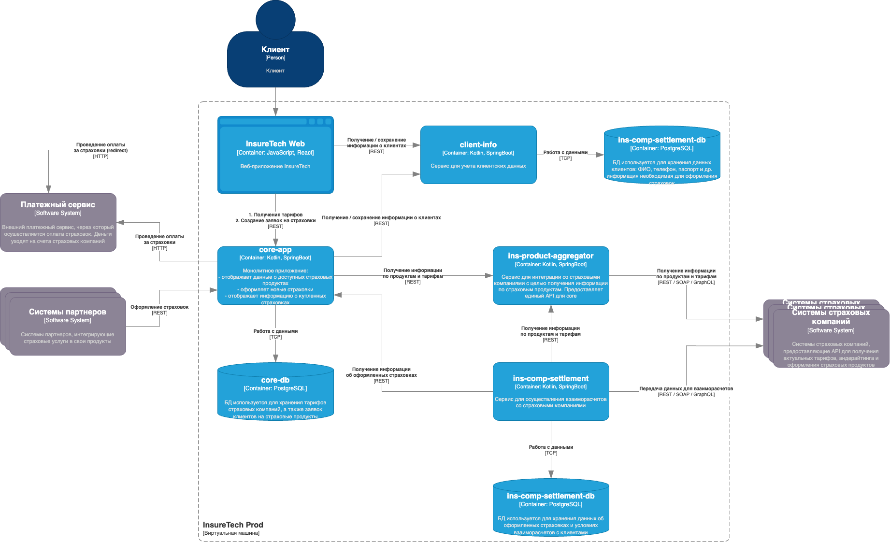

# Архитектура приложения

Основные компоненты приложения:

* **core-app** — монолитное бэкенд-приложение. Оно отвечает за отображение доступных клиенту продуктов, оформление заявок на новые страховки и отображение уже оформленных.
* **client-info** — сервис управления клиентскими данными. Он передаёт данные core-app для оформления страховок. Если пользователя нет в базе данных или его данные изменились, в процессе оформления страховки сервис client-info вносит данные в базу. Он же отвечает за отображение и редактирование клиентских данных в личном кабинете.
* **ins-product-aggregator** — сервис интеграции со страховыми компаниями для получения информации о продуктах. Ещё он запрашивает у разных партнёров предложения по ОСАГО для конкретного автомобиля. Сервис предоставляет единый API, агрегируя данные от всех страховых компаний.
* **ins-comp-settlement** — сервис взаиморасчётов со страховыми компаниями. Раз в месяц он отправляет перечень оформленных страховок в страховые компании для расчёта выплаты агентских премий.
* Веб-приложение для клиентов сервиса.

Для деплоя всех приложений используется кластер Kubernetes, расположенный в одной зоне доступности.

В качестве базы данных используется PostgreSQL. Каждый сервис, использующий БД, имеет отдельную схему данных. БД развёрнута на отдельной ВМ в единственном экземпляре.

Взаимодействие между фронтендом и бэкендом происходит посредством REST.

API предоставляет партнёрам доступ напрямую через LoadBalancer Kubernetes, который доступен в сети Интернет.

Бэкенд-приложение интегрировано с пятью страховыми компаниями.

Вот диаграмма контейнеров приложения в модели C4:

